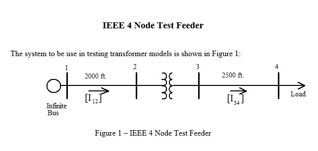

# DiTTo

[](https://travis-ci.org/NREL/ditto)
[](https://gitter.im/NREL/ditto)
[](https://nrel.github.io/ditto)
[](https://codecov.io/gh/NREL/ditto)

DiTTo is a _Distribution Transformation Tool_ that aims at providing an open source framework to convert various distribution systems modeling formats.
DiTTo implements a _many-to-one-to-many_ parsing framework which makes it modular and robust.
Readers and writers are then implemented to perform the translation from a given format to the core representation, or the other way around.


## Quick Start

### Install DiTTo

```bash
pip install git+https://github.com/NREL/ditto.git@v0.1.0#egg=ditto[all]
```

### Basic Usage



source=http://sites.ieee.org/pes-testfeeders/resources/

The most basic capability of DiTTo is the conversion of a distribution system from one format to another. Let's say we have the IEEE 4 node feeder in OpenDSS format as a file called ```master.dss```:

```
clear

new circuit.4BusYYbal basekV=12.47 phases=3

!Wires definition
new wiredata.conductor Runits=mi Rac=0.306 GMRunits=ft GMRac=0.0244  Radunits=in Diam=0.721
new wiredata.neutral   Runits=mi Rac=0.592 GMRunits=ft GMRac=0.00814 Radunits=in Diam=0.563

!LineGeometry definition
new linegeometry.4wire nconds=4 nphases=3 reduce=yes cond=1 wire=conductor units=ft x=-4 h=28 cond=2 wire=conductor units=ft x=-1.5 h=28 cond=3 wire=conductor units=ft x=3 h=28 cond=4 wire=neutral units=ft x=0    h=24

!Lines definition
new line.line1 geometry=4wire length=2000 units=ft bus1=sourcebus bus2=n2
new line.line2 bus1=n3 bus2=n4 geometry=4wire length=2500 units=ft

!Transformer definition
new transformer.t1 xhl=6 wdg=1 bus=n2 conn=wye kV=12.47 kVA=6000 %r=0.5 wdg=2 bus=n3 conn=wye kV=4.16  kVA=6000 %r=0.5

!Load definiion
new load.load1 phases=3 bus1=n4 conn=wye kV=4.16 kW=5400 pf=0.9  model=1 vminpu=0.75

!Set voltage base and solve circuit
set voltagebases=[12.47, 4.16]
calcvoltagebases
solve
```

To convert this system to another format, say CYME for example, the easiest way is to use the command line interface. From the directory where ```master.dss``` is located, run:

```bash
$ ditto-cli convert --from opendss --to cyme --input ./master.dss --output .
```

This command basically reads the OpenDSS input (```./master.dss```) into the DiTTo core representation and output the system to CYME (since the output is ".", the files will be written in the same folder).

After running this command you should see the output in the current directory:

```bash
$ ls | grep .txt
./equipment.txt
./loads.txt
./network.txt
```

### Going further

More documentation can be found [here](https://nrel.github.io/ditto).

Documentation on converting other formats can be found [here](https://nrel.github.io/ditto/cli-examples.html). 

## Contributing
DiTTo is an open source project and contributions are welcome! Either for a simple typo, a bugfix, or a new parser you want to integrate, feel free to contribute.

To contribute to Ditto in 3 steps:
- Fork the repository (button in the upper right corner of the DiTTo GitHub page).
- Create a feature branch on your local fork and implement your modifications there.
- Once your work is ready to be shared, submit a Pull Request on the DiTTo GitHub page. See the official GitHub documentation on how to do that [here](https://help.github.com/articles/creating-a-pull-request-from-a-fork/)

## Getting Help

If you are having issues using DiTTo, feel free to open an Issue on GitHub [here](https://github.com/NREL/ditto/issues/new)

All contributions are welcome. For questions about collaboration please email [Tarek Elgindy](mailto:tarek.elgindy@nrel.gov)
